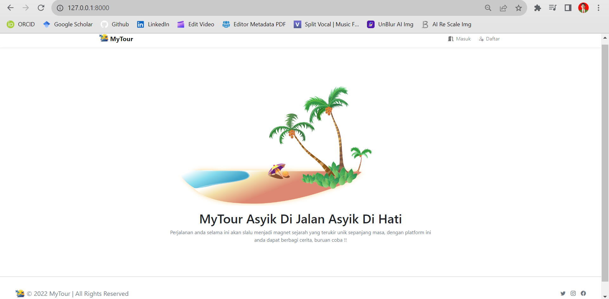
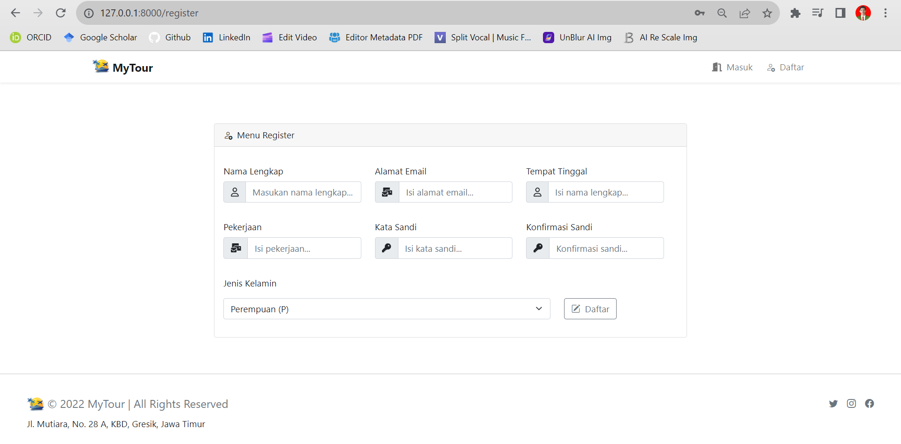
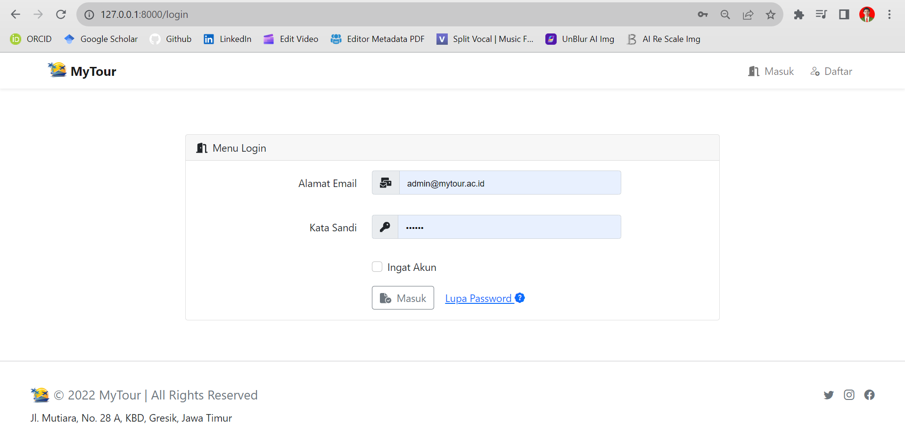
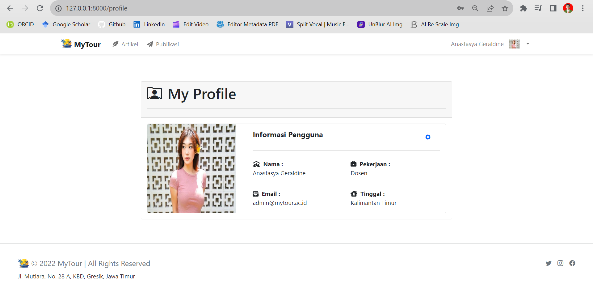

[](https://github.com/ellerbrock/open-source-badges/)
[](https://opensource.org/licenses/MIT)


# task-5-fullstack
<strong>Virtual Internship Experience (Investree) - Fullstack - Devan Cakra Mudra Wijaya</strong><br><br>
Tema proyek ini berkaitan erat dengan pariwisata. Saya menyebut proyek web ini ``` MyTour ```, fitur yang diunggulkan adalah bercerita. Menurut saya ini menarik, karena pengguna bisa berbagi momen perjalanan mereka yang berharga layaknya media sosial. Yang membedakan web ini dengan yang lain adalah mengutamakan kenyamanan pengguna dalam memposting foto, karena aturannya yaitu pengguna lain tidak bisa berkomentar atau hanya bisa melihat saja.

<br><br>

## Kebutuhan Proyek
| Bagian | Deskripsi |
| --- | --- |
| Fitur | Masuk, Buat, Baca, Ubah, Hapus, Paginasi |
| Kerangka kerja | Bootstrap 5, Laravel 8, VueJS |
| Peralatan | Visual Studio Code, XAMPP (PHP Versi 8), NodeJS |

<br><br>

## Unduh & Instal
1. XAMPP dengan PHP versi 8

   <table><tr><td width="810">

   ```
   https://bit.ly/XAMPP_PHP8_Installer
   ```

   </td></tr></table><br>

2. Visual Studio Code

   <table><tr><td width="810">

   ```
   https://bit.ly/VScode_Installer
   ```

   </td></tr></table><br>

3. NodeJS

   <table><tr><td width="810">

   ```
   https://bit.ly/NodeJS_Installer
   ```

   </td></tr></table>

<br><br>

## Basis data
1. Buka ``` XAMPP ```, lalu tekan tombol mulai di bagian ``` Apache ``` & ``` MySQL ```. Hal ini bertujuan untuk dapat mendukung website secara optimal.<br><br>

2. Akses peramban terlebih dahulu untuk membuka panel admin basis data, silakan salin tautan berikut: ``` localhost/phpmyadmin/ ```.<br><br>

3. Buat basis data bernama ``` mytour ``` di lokal.<br><br>

4. Buka basis data ``` mytour ``` dan Impor ``` mytour.sql ``` di direktori ``` MyTour/public/sql ```.<br><br>

5. Kemudian buka berkas XAMP: ``` php.ini ``` -> hapus ``` titik koma (;) ``` di depan ``` extension=intl ``` -> simpan.
   
<br><br>

## Akun Bawaan
| Peran | Surel | Nama | Kata Sandi |
| --- | --- | --- | --- |
| Admin | admin@mytour.ac.id | Anastasya Geraldine | 456123 |
| User | user1@mytour.ac.id | Andikha Refanza | 456123 |
| User | user1@mytour.ac.id | Alfiansyah Nukita Prada | 456123 |

<br><br>

## Memulai
1. Unduh dan ekstrak repositori ini.<br><br>

2. Buka direktori ``` MyTour ```, lalu buka ``` CMD ``` di dalam direktori tersebut.<br><br>

   • Pertama, jika tidak ada kesalahan yang terjadi maka lewati saja langkah ini, tetapi jika sebaliknya, silakan salin perintah berikut:

      <table><tr><td width="810">

      ````bash
      npm install
      ````

      </td></tr></table><br>

   • Kedua, langkah ini wajib dilakukan, jadi silakan salin perintah berikut:

      <table><tr><td width="810">

      ````bash
      npm run dev
      ````

      </td></tr></table><br>

   • Ketiga, langkah ini wajib dilakukan, jadi silakan salin perintah berikut ini:

      <table><tr><td width="810">

      ````bash
      php artisan serve
      ````

      </td></tr></table><br>

3. Buka ``` Chrome ``` -> Tambahkan ekstensi bernama ``` Vue.js devtools ```.<br><br>

4. Buka ``` peramban ``` anda (Tab baru), lalu ketik -> ``` http://127.0.0.1:8000/ ``` atau sesuaikan dengan yang ada di ``` CMD ``` anda.<br><br>

5. Silakan masuk dan akses fitur-fiturnya, selamat menikmati [Selesai].

<br><br>

## Sorotan
<table>
<tr>
<th width="280">Beranda</th>
<th width="280">Registrasi</th>
<th width="280">Masuk</th>
</tr>
<tr>
<td></td>
<td></td>
<td></td>
</tr>
</table>
<table>
<tr>
<th width="280">Atur Ulang Kata Sandi</th>
<th width="280">Profil</th>
<th width="280">Ubah Profil</th>
</tr>
<tr>
<td></td>
<td></td>
<td></td>
</tr>
</table>
<table>
<tr>
<th width="280">Tulis Artikel</th>
<th width="280">Kelola Arsip</th>
<th width="280">Fitur Ubah Artikel</th>
</tr>
<tr>
<td></td>
<td></td>
<td></td>
</tr>
</table>
<table>
<tr>
<th width="280">Publikasi Artikel</th>
<th width="280">Kategori Umum</th>
<th width="280">Kategori Khusus</th>
</tr>
<tr>
<td></td>
<td></td>
<td></td>
</tr>
</table>

<br><br>

## Apresiasi
Jika karya ini bermanfaat bagi anda, maka dukunglah karya ini sebagai bentuk apresiasi kepada penulis dengan mengklik tombol ``` ⭐Bintang ``` di bagian atas repositori.

<br><br>

## Penafian
Aplikasi ini merupakan hasil karya saya sendiri dan bukan merupakan hasil plagiat dari penelitian atau karya orang lain, kecuali yang berkaitan dengan layanan pihak ketiga yang meliputi: pustaka, kerangka kerja, dan lain sebagainya.

<br><br>

## LISENSI 
LISENSI MIT - Hak Cipta © 2022 - Devan C. M. Wijaya, S.Kom

Dengan ini diberikan izin tanpa biaya kepada siapa pun yang mendapatkan salinan perangkat lunak ini dan file dokumentasi terkait perangkat lunak untuk menggunakannya tanpa batasan, termasuk namun tidak terbatas pada hak untuk menggunakan, menyalin, memodifikasi, menggabungkan, mempublikasikan, mendistribusikan, mensublisensikan, dan/atau menjual salinan Perangkat Lunak ini, dan mengizinkan orang yang menerima Perangkat Lunak ini untuk dilengkapi dengan persyaratan berikut:

Pemberitahuan hak cipta di atas dan pemberitahuan izin ini harus menyertai semua salinan atau bagian penting dari Perangkat Lunak.

DALAM HAL APAPUN, PENULIS ATAU PEMEGANG HAK CIPTA DI SINI TETAP MEMILIKI HAK KEPEMILIKAN PENUH. PERANGKAT LUNAK INI DISEDIAKAN SEBAGAIMANA ADANYA, TANPA JAMINAN APAPUN, BAIK TERSURAT MAUPUN TERSIRAT, OLEH KARENA ITU JIKA TERJADI KERUSAKAN, KEHILANGAN, ATAU LAINNYA YANG TIMBUL DARI PENGGUNAAN ATAU URUSAN LAIN DALAM PERANGKAT LUNAK INI, PENULIS ATAU PEMEGANG HAK CIPTA TIDAK BERTANGGUNG JAWAB, KARENA PENGGUNAAN PERANGKAT LUNAK INI TIDAK DIPAKSAKAN SAMA SEKALI, SEHINGGA RISIKO ADALAH MILIK ANDA SENDIRI.
